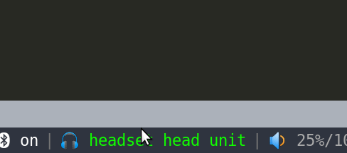

# i3blocks-airpods
i3blocks script for airpods  
## controls
left click: connect to airpods  
middle: toggle A2DP or HSP/HFP  
right click: disconnect airpods
## a live shot for you


## Dependencies
```
   1.ofono.service  
   2.ofono-phonesim  
       sudo add-apt-repository ppa:smoser/bluetooth  
       sudo apt-get install ofono-phonesim  
   3.git clone https://github.com/rilmodem/ofono.git /opt/ofono  
```

## i3blocks.conf
```
[airpods]
label=🎧 
interval=10
```

## Notice
you should first pair your airpods using blueman and trust them

## Say thanks:
  
  Just letting me know you're enjoying this plugin is a great way to say thanks!
  
  You can do so by staring the GitHub repo.
  
## Troubles?
  
  If you have any kind of trouble with it, just let me now by raising an issue on
  the GitHub issue tracker here:

  It should be there 👆 👀
